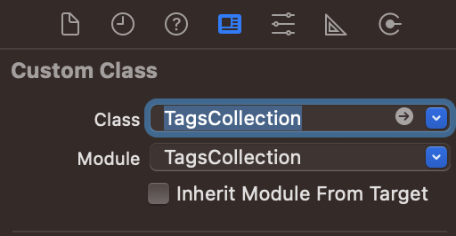

# TagsCollection
TagsCollection

<p align="center">
  
</p>

[](https://travis-ci.org/amrangry/TagsCollection)
[](https://cocoapods.org/pods/TagsCollection)
[](https://cocoapods.org/pods/TagsCollection)
[](https://github.com/amrangry/TagsCollection/blob/main/LICENSE)
[](https://cocoapods.org/pods/TagsCollection)

[](https://cocoapods.org/pods/TagsCollection) 

[](https://github.com/apple/swift-package-manager) 


  


## Example

To run the example project, clone the repo, and run `pod install` from the Example directory first.

## Screenshots

<!---->
 
 
## Requirements

## Installation

TagsCollection is available through [CocoaPods](https://cocoapods.org). To install
it, simply add the following line to your Podfile:

```ruby
pod 'TagsCollection'
```

### Swift Package Manager (SPM)
The Swift Package Manager is a tool for automating the distribution of Swift code and is integrated into the swift compiler. To integrate using Apple's Swift package manager from xcode :

File -> Swift Packages -> Add Package Dependency...

enter package URL : https://github.com/amrangry/TagsCollection/.git , choose the latest release

### Manually
To install manually the TagsCollection classes in your app, just drag the Source class files (demo files and assets are not needed) into your project.

Add content of folder Source/* to your project

## How it works "Usage"

Setup in Interface Builder
In the Identity Inspector, set the layout object's custom class to TagsCollection.

Step 1. In the Identity Inspector, set the layout object's custom class to `TagsCollection`.

 
 
Step 2. Import `TagsCollection` module to your `Swift` class
```swift
    import TagsCollection
```
Step 3. Connect View with IBOutlet to your `Swift` class

    ```Swift
    @IBOutlet weak var tagsCollection: TagsCollection?
    ```
Step 4. Enjoy :)

## Versioning

this project adheres to [Semantic versioning](https://semver.org/)

Given a version number MAJOR.MINOR.PATCH, increment the:

- MAJOR version when you make incompatible API changes,
- MINOR version when you add functionality in a backwards compatible manner, and
- PATCH version when you make backwards compatible bug fixes.

## TODO

* [x] Segregate UIKit & Foundation
* [ ] CI/CD 
* [ ] More test test test ... (and example)

## Contributing

We alway welcome your contributions :clap:

### Development

1. Fork (https://github.com/amrangry/TagsCollection) :tada:
1. Create a feature branch :coffee:
1. Run test suite with the `$ make test` command and confirm that it passes :zap:
1. Commit your changes :memo:
1. Rebase your local changes against the `main` branch :bulb:
1. Create new Pull Request :love_letter:

Bugs, feature requests and comments are more than welcome in the [issues](https://github.com/amrangry/TagsCollection/issues).

### Feedback

I would like to make `TagsCollection` a better tool.  
The goal is to be able to use in various projects.

Therefore, your feedback is very useful.  
I am very happy to tell you your opinions on Issues and PR :heart:

## **Author**

<div align="center">
  

  **Amr Ahmed Elghadban (AmrAngry)**

[](mailto:amr.elghadban@gmail.com) [](https://api.whatsapp.com/send/?phone=00971543233227&text=Hi%20&app_absent=0) [](https://www.linkedin.com/in/amrelghadban/)

[](https://github.com/amrangry) [](https://stackoverflow.com/users/1316779/amrangry)

[](https://x.com/intent/follow?screen_name=amr_elghadban) [](https://facebook.com/amr.elghadban) [](https://amrangry.github.io/)
       <div align="center" >
	       <a href = "https://www.buymeacoffee.com/amrangry">
		    
                </a>
       </div>
  <!--  [](https://www.buymeacoffee.com/amrangry) -->
  <!--  [Email](mailto:amr.elghadban@gmail.com?subject=I%20checked%20your%20GitHub%20repo!): [amr.elghadban@gmail.com](mailto:amr.elghadban@gmail.com) -->
  <!-- [](https://www.linkedin.com/in/amrelghadban/) -->
  <!-- [](https://x.com/intent/follow?screen_name=amr_elghadban) -->
  
</div>

## **Contributing 🤘**

All your feedback and help to improve this project is very welcome. Please create issues for your bugs, ideas & enhancement requests, or better yet, contribute directly by creating a PR. 😎

When reporting an issue, please add a detailed instruction, and if possible a code snippet or test that can be used as a reproducer of your problem. 💥

When creating a pull request, please adhere to the current coding style where possible, and create tests with your code so it keeps providing an awesome test coverage level 💪

## **License**

<details>
<summary><strong>MIT License</strong></summary>
<p>
TagsCollection is distributed under the MIT License.  
For more information, see the <a href="[https://github.com/amrangry/iStarWars/blob/master/LICENSE](https://github.com/amrangry/TagsCollection/blob/master/LICENSE))" target="_blank">LICENSE</a> file.  

&copy; 2025 Amr Elghadban  
All rights reserved.
</p>
